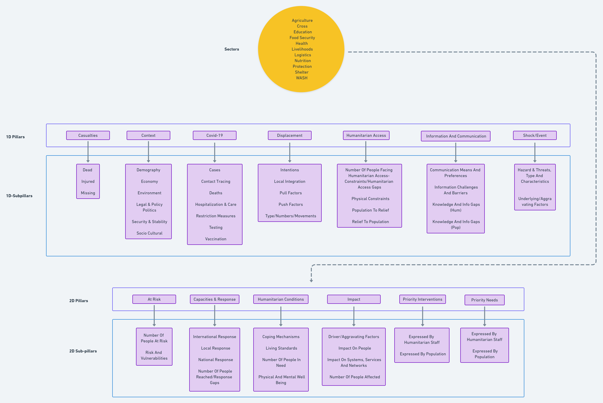
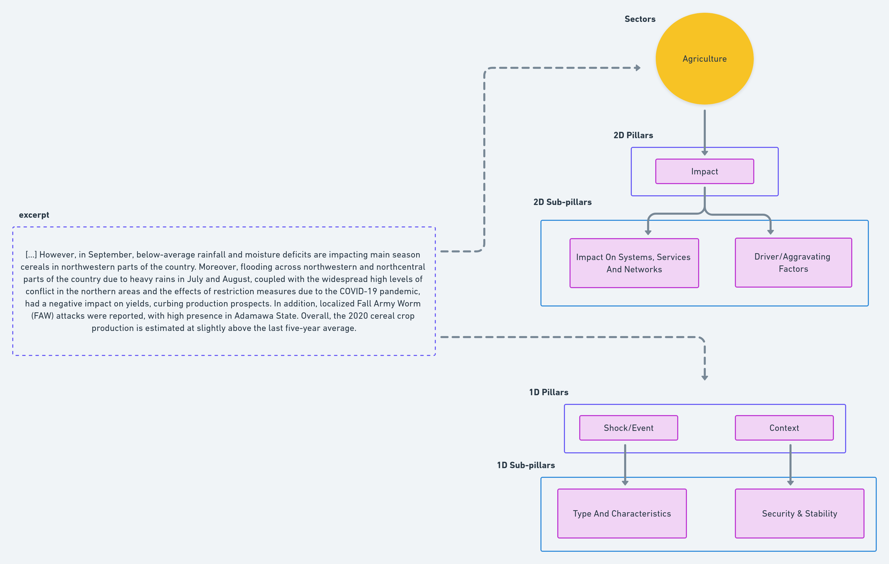
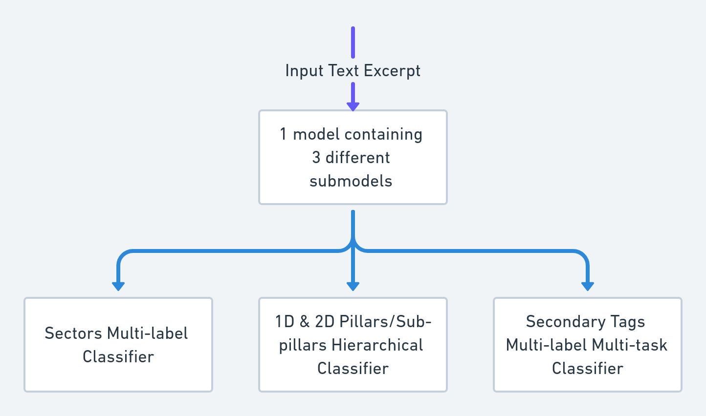

### DEEP Assisted Tagging Tool

 Open project in AWS StudioLab. For a working environment select "Clone Entire Repo" at start.

In this notebook we propose an example of the main model architecture for the assisted tagging tool that will soon be implemented in [**The DEEP**](https://thedeep.io/) platform.

Let's recap for completeness what The DEEP is, and how Machine Learning models improve its use. 

The DEEP is a collaborative platform for qualitative data analysis supporting humanitarian analytical teams to produce actionable insights. Since its inception in the aftermath of the 2015 Nepal Earthquake, DEEP has significantly contributed to improving the humanitarian data ecosystem, and today, without a doubt, is the largest repository of annotated humanitarian response documents: 50k+ sources/leads and 400k+ entries, used for 300+ projects by 3.5k+ registered users in 60+ countries.

During crises, rapidly identifying important information from available data (news, reports, research, etc.) is crucial to understanding the needs of affected populations and to improving evidence-based decision-making. To make the information classification process even faster, DEEP is largely benefitting from  Natural Language Processing (NLP) and Deep Learning (DL) to aid and support the manual tagging process and give the humanitarian community more time to produce analyses and take rapid action to save more lives.

Up to now, all the information (of any kind: reports, news, articles, maps, infographics, etc.) uploaded to the platform has been annotated by hand by experts in the humanitarian sector. The tagging was done under several projects according to different predefined multi-label categories (analytical frameworks). Since the data is mostly textual, we internally developed NLP models that could improve and speed up the analysis of the texts. 

We must also consider that informations are often contained within document reports (PDF, docx etc.) of numerous pages, making the tagging effort very difficult and time-consuming, therefore we understand how important it can be to optimize the humanitarian response during, for example, an ongoing natural disaster.

### Data

Let's go into the details of the model now, starting from the data.

In The DEEP platform each user or group has the possibility to create a project, which is usually link to a certain humanitarian crisis, such as a natural disaster, or to a certain geographic region or state where a rapid response is needed. Users can create custom labels and use them to annotate the information that will be uploaded within each project. Therefore each user will have the possibility to upload, for example, a document (of any format), select an exerpt of text (which perhaps contains important details for the purpose of the analysis) and annotate it using its own project labels. 

To combine entries from those projects and various analytical frameworks (set of labels), we defined a generic analytical framework and we transformed our labels accordingly. Our generic analytical framework has 10 different multi-label categories, totalling 86 different labels, covering all areas of a detailed humanitarian analysis.

Our proposed dataset contains 8 categories overall:
- 3 **primary tags**: sectors, pillars/subpillars_2d, pillars/subpillars_1d
- 5 **secondary tags**: affected_groups, demographic_groups, specific_needs_groups, severity, geolocation

Different tags are treated independently one from another. One model is trained alone for each different tag.

In this notebook we focus only on a subset of above categories, the **primary tags**.
Primary tags contain 75 labels under different subcategories named as follows: 
- **Sectors** with 11 labels,
- **2D Pillars** with  6 labels,
- **2D Sub-pillars** with  18 labels,
- **1D Pillars** with  7 labels,
- **1D Sub-pillars** with  33 labels

Let's see how they are divided:

We can see that, apart from Sectors, each subcategory has an annotation hierarchy, from Pillar to Sub-pillar (1D and 2D) . Furthermore, each text excerpt can be annotated with multiple labels, thus making the problem a multi-label text classification.

The difference between 1D and 2D Pillars (and respective Sub-pillars), as we can see in the previous image, lies in the fact that the 2D subcategory presents an additional level of hierarchy, given by the Sectors. Example:

Excerpts of text are in 3 different languages: **English**, **Spanish** and **French**.

### Model

The model developed is based on pre-trained transformer architecture. The transformer had to fulfill some criteria:
- **multilingual** : it needs to work for different languages
- **good performance** : in order for it to be useful, the model needs to be performant
- **fast predictions** : the main goal of the modelling is to give live predictions to taggers while they are working on tagging. Speed is critical in this case and the faster the model the better.
- **one endpoint only for deployment**: in order to optimize costs, we want to have one endpoint only for all models and predictions. To do this, we create one custom class containing models and deploy it.

We use the transformer [**microsoft/xtremedistil-l6-h256-uncased**](https://huggingface.co/microsoft/xtremedistil-l6-h256-uncased) as a backbone

In this notebook we overall train three independent models: one for sectors, one for subpillars (1D and 2D) and one for secondary. 
Sectors is trained with a MLP-like standard architecture.

For the subpillars tags, we use a tree-like multi-task learning model, fine-tuning the last hidden state of the transformer differently for each subtask. We have 13 different subtasks for the subpillars model (Humanitarian Conditions, At Risk, Displacement, Covid-19, Humanitarian Access, Impact, Information And Communication, Shock/Event, Capacities & Response, Context, Casualties, Priority Interventions, Priority Needs) each of which then has its own final labels, which we want to predict.
This allows us to share the encoding information, obtained from our transformer backbone, and then train different heads separately depending on the hierarchy, further annealing the problems due to data imbalance and also some subtle differences between labels. 

The 5 first hidden layers from the backbone are common to all the tasks and the last hidden layer is specific to each task. We have, in total, 13 different sub-tasks for the subpillars model, for a total of 51 different tags.

After training and to optimize our results, we hypertune the threshold for each label to optimize the f1 score on the validation set. Therefore, each different label has a different threshold. This keeps the models from overtagging and helps adapt to the data imbalanceness problem.

In secondary tags we don't have a hierarchy, so the submodel is only a multi-task architecture

See the notebook for implementation details.
