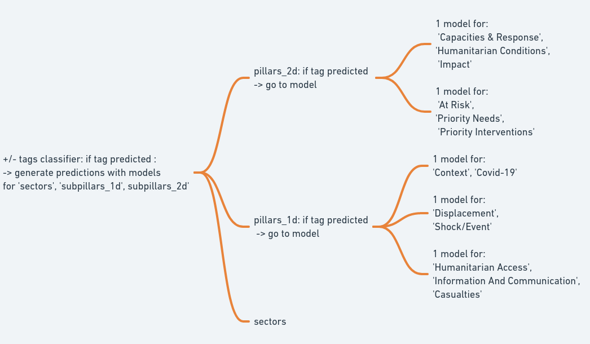
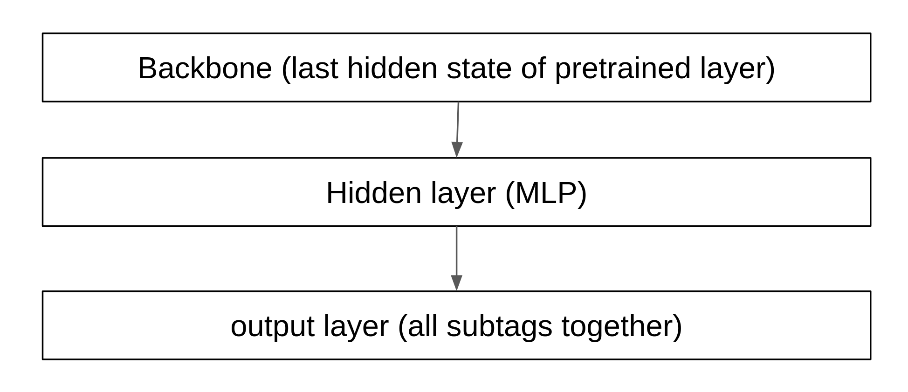

Folder containing script used to generate models that are performing the best.  
<ins>loss</ins>: Weighted Binary Cross Entropy  
<ins>whole models architecture</ins>: 9 models overall:   
<ins>one model architecture</ins>: 9 models overall:   
